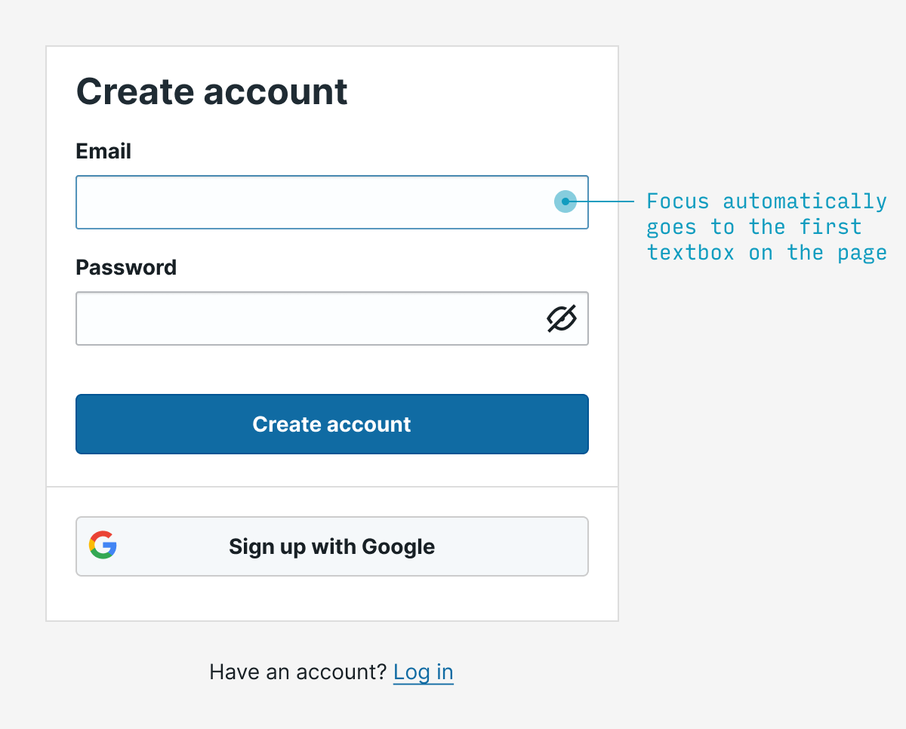
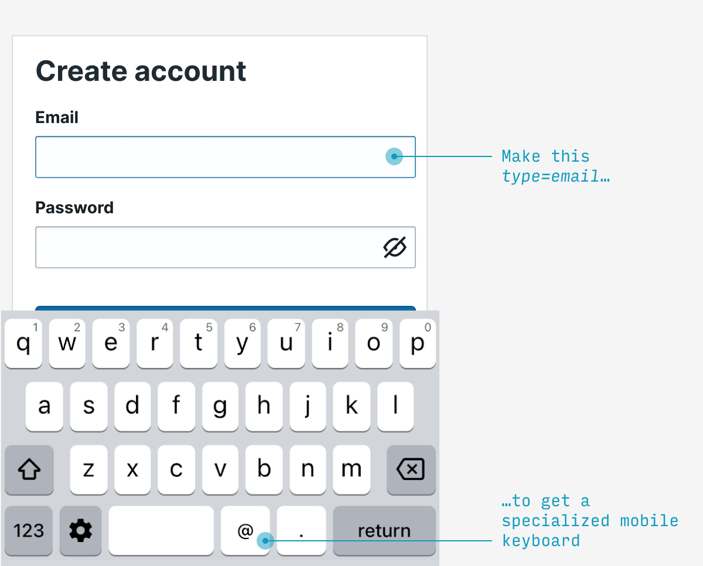
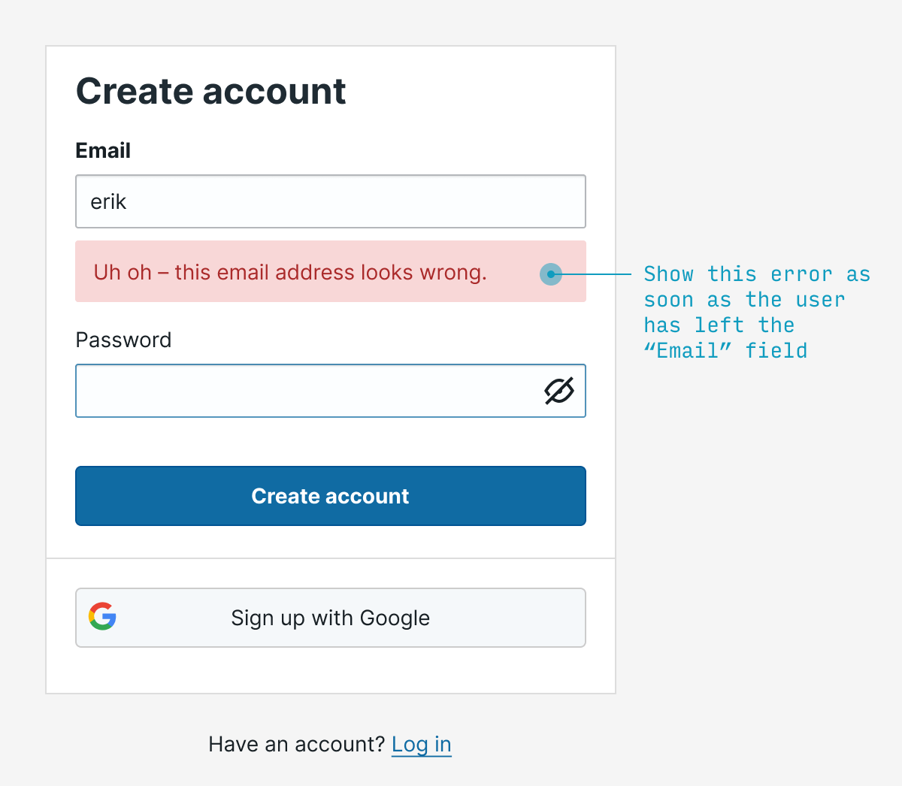
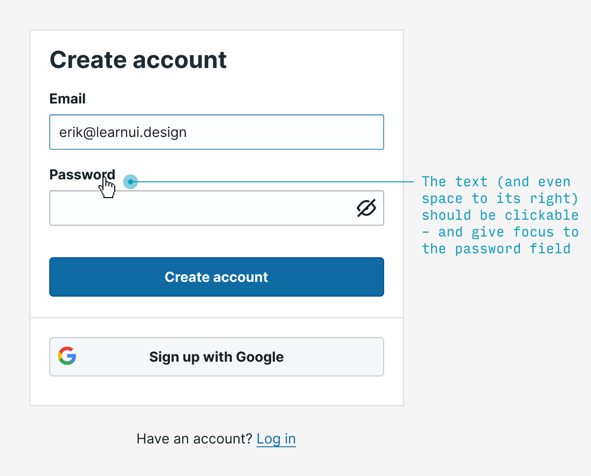
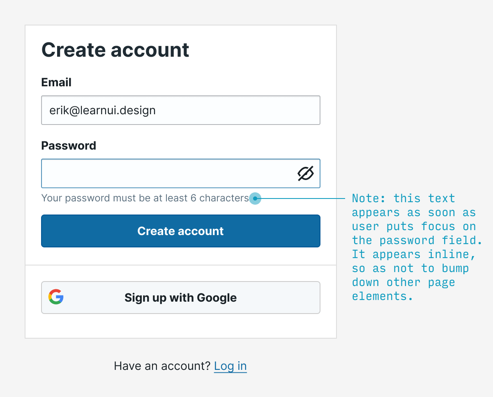
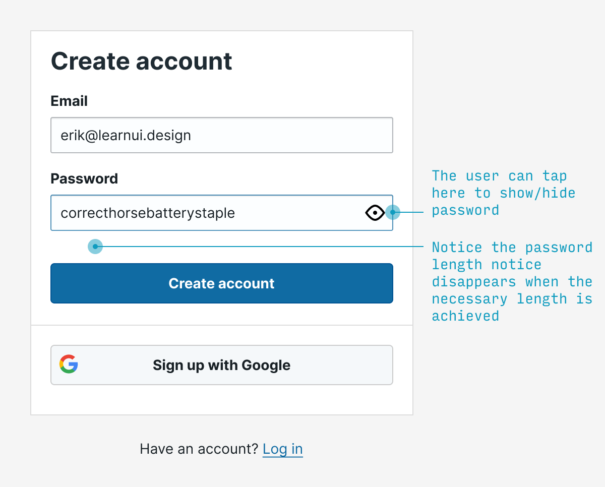
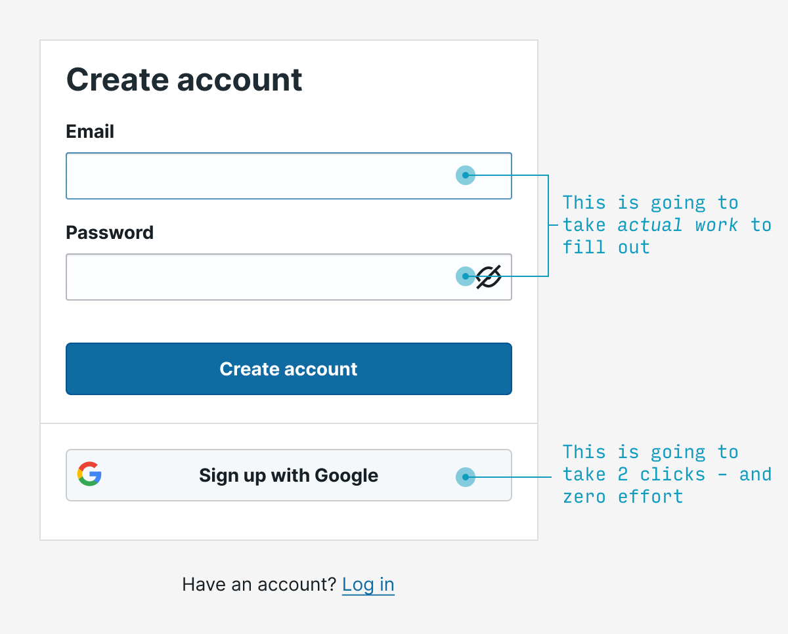
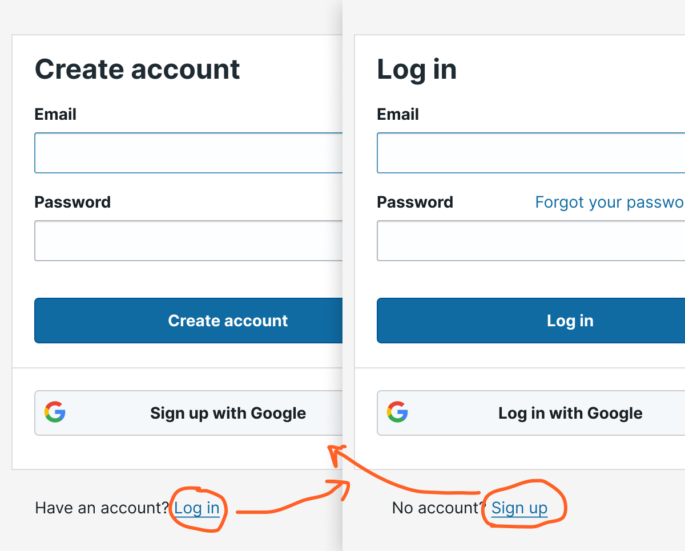
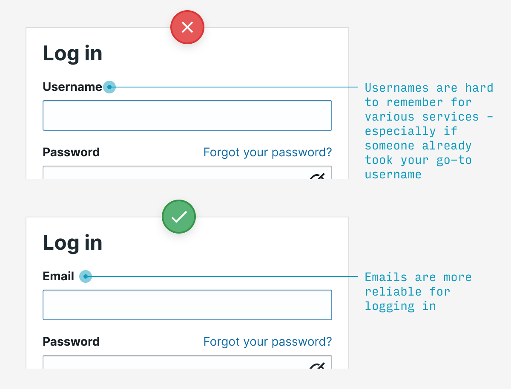

# 15个Tips for 注册&登录UX

“具有讽刺意味的是，交互设计的基本规则是：‎‎删除交互‎‎。删除点击，删除读取，删除等待，删除思考”

## 1. 第一个field自动聚焦
一个简单的例子：如果你知道‎‎，从字面上95%‎‎的人打开注册表单将‎‎立即‎‎点击到第一个字段，‎‎省去他们的麻烦‎‎，并`自动聚焦`于它

## 移动端：不同的表单字段，使用指定的键盘

简单的标识字段的类型，就能极大的改善用户的输入体验。

比如输入邮箱时需要输入"@"和"."，就需要切换键盘类型。

做法：在邮箱字段指定``type=email``，在手机号字段指定``type=tel``，数字字段指定``type=num``，链接字段指定``type=url``

## 立即验证表单

与其在用户填完表单后通知错误，不如在系统发现错误后立即通知

做法：在表单字段失去焦点时，立即验证错误并提醒

## 使表单字段的标签也可点击聚焦

有待验证

## 用户开始输入密码，立即展示密码要求

取消此条

## 密码策略
1. 允许用户查看已经输入的密码：减少用户输错密码，输入多次，以及疑惑并重置密码的难受场景
2. 密码不提供详细错误提示，仅提示`账号或密码错误`
3. 甚至不提示本站的基本密码要求

第二条是个人策略调整，我认为密码具有较高的隐私性，不该给过多提示

## 提供其他平台账号一键登录

## “登录”和“注册”之间轻松切换

## 登录使用邮箱和手机，不要用用户名
这么多网站的用户名太难记了，而邮箱和手机则更通用

